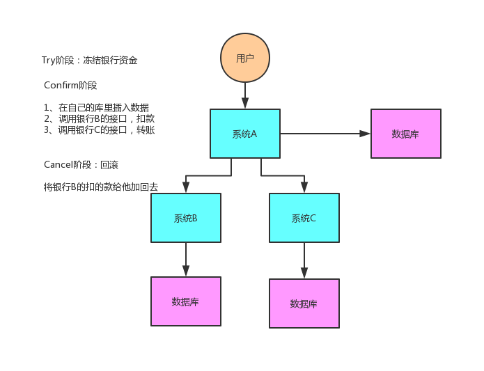

## 什么是TCC？
TCC的全称是：Try、Confirm、Cancel。

## TCC的三个阶段
这个其实是用到了补偿的概念，分为了三个阶段：
### 1）Try阶段
这个阶段说的是对各个服务的资源做检测以及对资源进行锁定或者预留
### 2）Confirm阶段
这个阶段说的是在各个服务中执行实际的操作
### 3）Cancel阶段
如果任何一个服务的业务方法执行出错，那么这里就需要进行补偿，就是执行已经执行成功的业务逻辑的回滚操作

## 举个例子再说下TCC的三个阶段
给大家举个例子吧，比如说跨银行转账的时候，要涉及到两个银行的分布式事务，如果用TCC方案来实现，思路是这样的：
### 1）Try阶段
先把两个银行账户中的资金给它冻结住就不让操作了
### 2）Confirm阶段
执行实际的转账操作，A银行账户的资金扣减，B银行账户的资金增加
### 3）Cancel阶段
如果任何一个银行的操作执行失败，那么就需要回滚进行补偿，就是比如A银行账户如果已经扣减了，但是B银行账户资金增加失败了，那么就得把A银行账户资金给加回去

## 适用场景
这种方案说实话几乎很少用人使用，我们用的也比较少，但是也有使用的场景。因为这个事务回滚实际上是严重依赖于你自己写代码来回滚和补偿了，会造成补偿代码巨大，非常之恶心。

比如说我们，一般来说跟钱相关的，跟钱打交道的，支付、交易相关的场景，我们会用TCC，严格严格保证分布式事务要么全部成功，要么全部自动回滚，严格保证资金的正确性，在资金上出现问题

比较适合的场景：这个就是除非你是真的一致性要求太高，是你系统中核心之核心的场景，比如常见的就是资金类的场景，那你可以用TCC方案了，自己编写大量的业务逻辑，自己判断一个事务中的各个环节是否ok，不ok就执行补偿/回滚代码。

而且最好是你的各个业务执行的时间都比较短。

但是说实话，一般尽量别这么搞，自己手写回滚逻辑，或者是补偿逻辑，实在太恶心了，那个业务代码很难维护。
