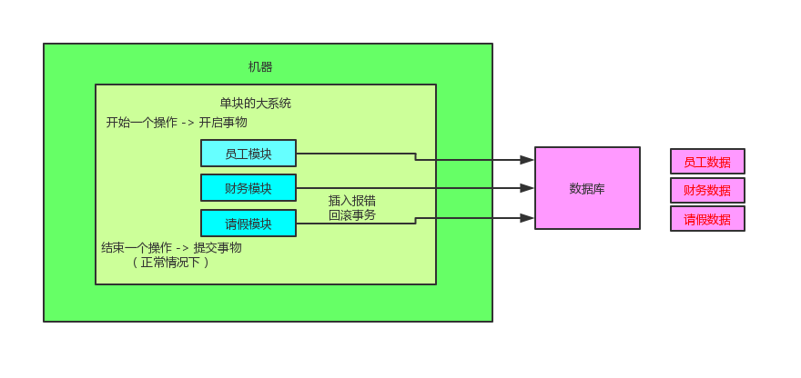
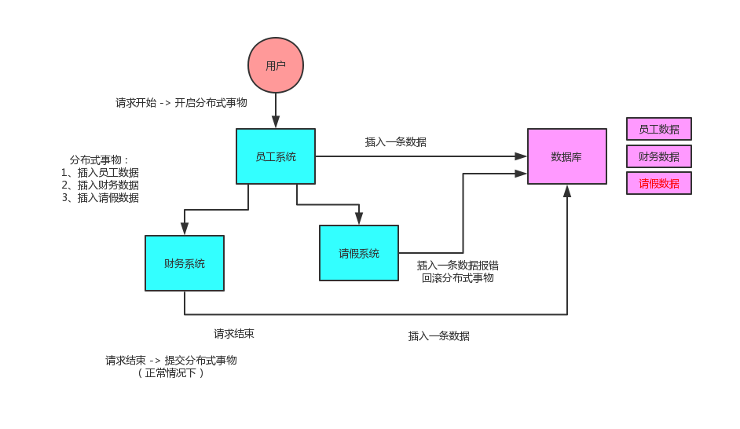

## 面试题

分布式事务了解吗？你们如何解决分布式事务问题的？

## 面试官心里分析

只要聊到你做了分布式系统，必问分布式事务，你对分布式事务一无所知的话，确实会很坑，你起码得知道有哪些方案，一般怎么来做，每个方案的优缺点是什么。

现在面试，分布式系统成了标配，而分布式系统带来的分布式事务也成了标配了。因为你做系统肯定要用事务吧，那你用事务的话，分布式系统之后肯定要用分布式事务吧。。。呵呵。。。先不说你搞过没有，起码你得明白有哪几种方案，每种方案可能有啥坑？比如TCC方案的网络问题、XA方案的一致性问题

## 单块系统里的事务

## 分布式系统里的事务

